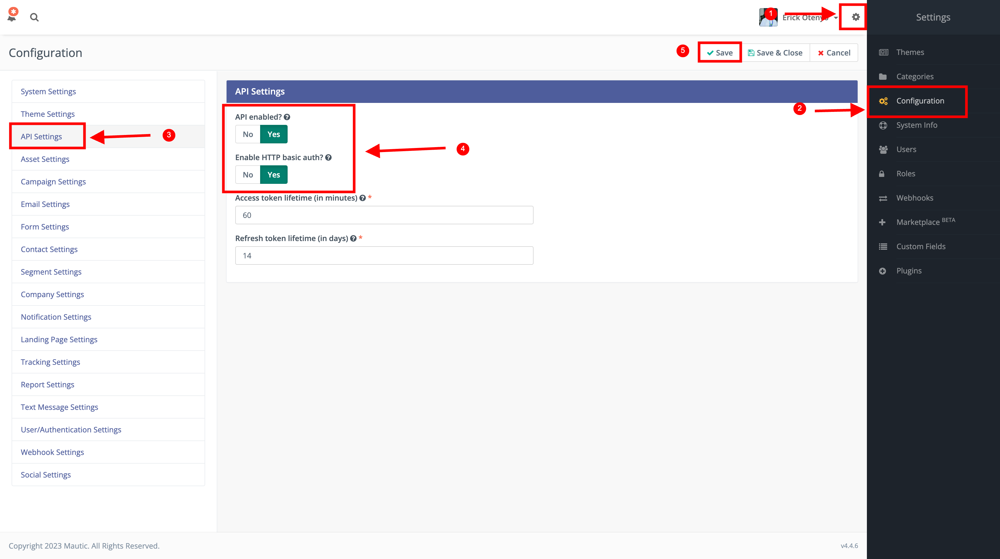
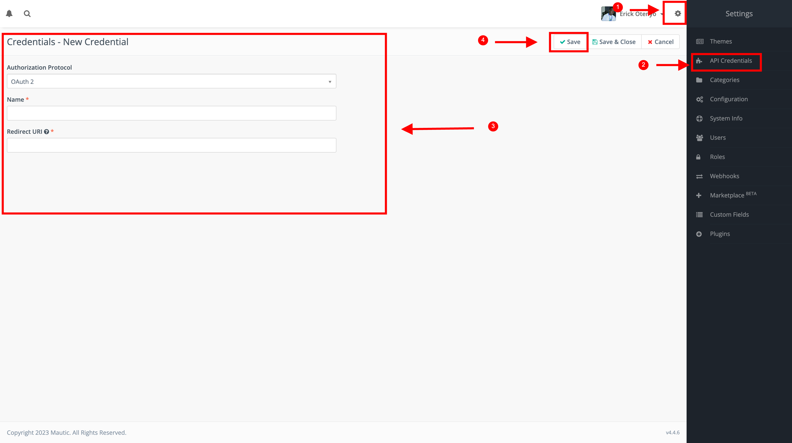
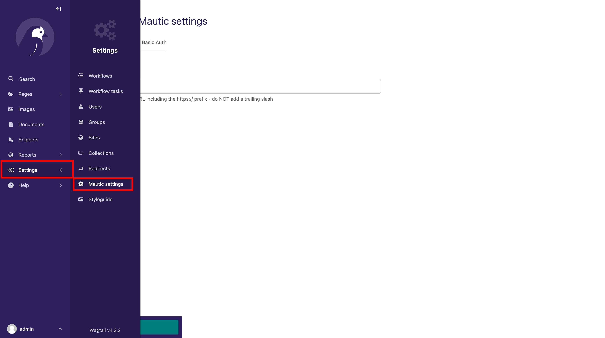
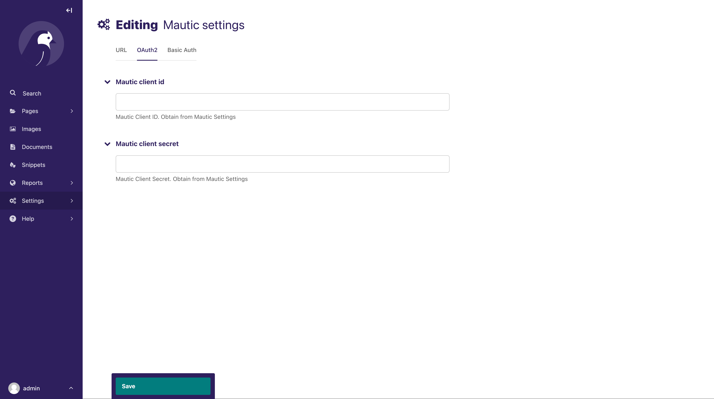
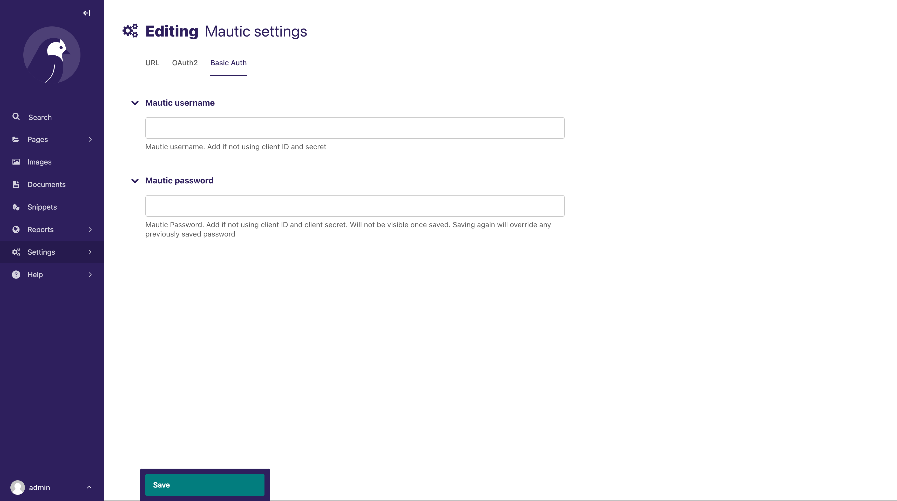
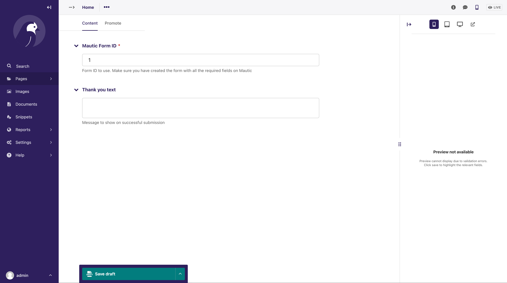

# Wagtail Mautic Integration
Integration of [Mautic](https://github.com/mautic/mautic) forms in Wagtail Projects.

# Background

We needed to allow our users to subscribe to a mailing list directly from a form rendered on a Wagtail Page.

Mautic is an open-source alternative to Mailchimp and fitted our needs. 

The aim of this package is to render a given Mautic Form on a Wagtail page, and send the submitted data to Mautic.
Other Mautic functionalities might be added later as need arises.


# Installation
Install using pip

```
pip install wagtail-mautic-integration
```

Add `wagtailmautic` to your installed apps. Make sure `wagtail.contrib.settings` is also added.

```
 INSTALLED_APPS = [
        ...
        "wagtailmautic",
        "wagtail.contrib.settings",
        ...
        ]
```


Run migrations
```
python manage.py migrate
```


# Mautic API Configuration

The Mautic API needs to be enabled from Mautic. Open your Mautic instance and follow the steps below to enable the Mautic
API

### Mautic API Setup
Follow the steps below to ensure the Mautic API is enabled from the Mautic Settings



1. Click on the settings icon to show the available settings
2. Click on Configuration
3. Select API Settings
4. Enable API by selecting `Yes`. If using HTTP Basic Auth (username and password for authentication), also select `Yes`
under Enable HTTP basic auth
5. Don't forget to Save. You can select Save and Close to Close after saving.

### Using OAuth 2
If you did not select to use HTTP basic auth, you can set up to use OAuth as below:



1. Click on the settings icon to show the available settings
2. Click on API Credentials. If the API Credentials option is not available, please follow the previous steps to enable the API
3. Set up the credentials name and Redirect URL
4. Don't forget to Save. After saving, a new page will be shown with your Client ID and Client Secret that you can use 
for authentication


# Wagtail Mautic Settings

Mautic Settings will be automatically added to the Wagtail Admin Menu as below



Add in the URL for your Mautic instance (including the https://) to the Mautic Url field.


You can use two methods for authentication:

- OAuth2 that requires client id and client secret from Mautic
- Basic Authentication that needs username and password. To use Basic Auth, you must enable this on Mautic Configuration
as described in the previous steps above

OAth2


Basic 




# Usage

The package provides an abstract wagtail page that uses a custom view to serve the Mautic Form.

Below is a sample snippet on how you can use it on your wagtail page that you want to serve the form.

Let us say you have a subscribe page, that should show a Mautic Form that your users can fill to subscribe to your mailing list

in your app's `models.py`:
```
from wagtail.models import Page

from wagtailmautic.models import BaseMauticFormPage


class MailingListSubscribePage(BaseMauticFormPage, Page):
    pass
```


Create the Page as usual in your CMS admin.

Edit the Page to add the Mautic Form ID



Add the form in your page's template

```
    <form method="POST">
        
        {{ form }}
        <div class="field">
            <button type="submit" class="button submit-button has-no-border">Submit</button>
        </div>
    </form>

```
The rendered page should now include a form with matching fields as setup on your Mautic form.
You can see a sample page in `sandbox/home/models`.

Submitting will send the form data to Mautic and show the thank you message that was set

You may want to override the default provided `form_thank_you_landing.html` template at `wagtailmautic/templates/form_thank_you_landing.html`

- First, create a templates directory in your project's root directory if it does not exist already.

- Inside the templates directory, create a directory with the name `wagtailmautic` whose template we want to override. 

- Inside the `wagtailmautic` directory, create a file with the same name as the template we want to override. In this case, create a file named `form_thank_you_landing.html`.

- Edit the new `form_thank_you_landing.html` template as desired.

